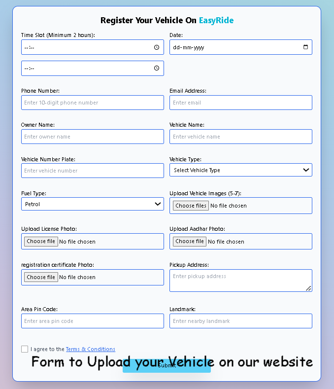
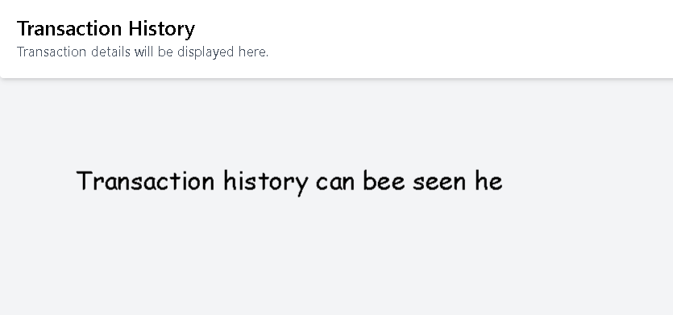

# 🚗 RentOut - Your Ultimate Vehicle Rental Platform

## 🌟 Project Overview

RentOut is a dynamic web application designed to simplify vehicle rentals. Whether you're looking to **rent a vehicle** for your journey or **list your own vehicle** for others to rent, RentOut makes it effortless and efficient.

### 🛠 Problem We Solve

- **Seamless Rentals**: Browse and book vehicles without hassle.
- **Earn from Your Vehicle**: Let your idle vehicle generate income.
- **Trust & Security**: Admin approval ensures verified vehicle listings.

### ✨ Key Features

✅ **Rent a Vehicle** - Find and book vehicles instantly.

✅ **List Your Vehicle** - Register and rent out your car with ease.

✅ **Admin Approval** - Ensures only verified vehicles are listed.

✅ **Chat Support** - Get real-time assistance.

✅ **Profile Management** - Update your details anytime.

✅ **Transaction History** - Track past bookings and payments.

✅ **Manage Listings** - View and edit your registered vehicles.

🔍 **Advanced Search Filters** - Find vehicles based on location, price, type, and availability.

---

## 📦 Dependencies

RentOut is powered by the latest tech stack:

- **Frontend:** Tailwind CSS, HTML, JavaScript
- **Backend:** Node.js, Express.js, MongoDB
- **Package Dependencies:**

```json
"dependencies": {
    "axios": "^1.8.1",
    "bcryptjs": "^2.4.3",
    "body-parser": "^1.20.3",
    "connect-mongo": "^5.1.0",
    "cookie-parser": "^1.4.7",
    "cookies": "^0.9.1",
    "cors": "^2.8.5",
    "express": "^4.21.0",
    "express-session": "^1.18.1",
    "jsonwebtoken": "^9.0.2",
    "mongoose": "^8.7.0",
    "multer": "^1.4.5-lts.1",
    "nodemon": "^3.1.7",
    "parser": "^0.1.4"
}
```

---

## 🚀 Setup Instructions

Get RentOut running in a few simple steps:

1. **Download & Extract** the project ZIP.
2. **Open in VS Code** and navigate to the main directory.
3. **Run the Server**:
   ```sh
   npm start
   ```
4. **Access the App**:
   - The **Dashboard** opens automatically.
   - Choose **"Book Now"** to rent a vehicle or **"Rent Out"** to list one.
   - The admin panel (running on `localhost:4000/admin.html`) will review and approve listings.
   - Approved vehicles appear on the **Explore section** (`index.html`).

---

## 🌍 Project Workflow

1. **Login/Signup Page** - Users can register or log in to access the platform. <br<br>

  <br><br>

After login/Register you will navigate to Daashboard<br><br>
 <br><br>
2. **Book a Ride** - Users can browse and rent a vehicle based on their choice.<br><br>
 <br><br>
5. **Rent Your Vehicle** - Users can list their vehicle for rent on the platform.<br><br>
 <br><br>
6. **Additional Features** - Profile updates, chat support, transaction history, a Terms and Condition , vehicle Status<br><br>
  (i) Chat Support<br><br>
 <br><br>
 (ii) Transaction history<br><br>
 <br><br>
 (iii) User Update <br><br>
  <br><br>

---

## 👥 Meet the Team

- **Sanjana Patel**
- **Shekhar Barkhede**
- **Nandkishore Mufadale**
- **Nikunj Bisani**

---

## 📜 License

This project is licensed under the **MIT License**.

---

## 🚀 Future Enhancements

🔹 AI-based vehicle recommendations.
🔹 Enhanced admin analytics dashboard.
🔹 More payment gateway integrations.
🔹 Expansion to other rental categories.

---

## 🤝 How to Contribute

We’d love your help in improving RentOut!

1. Fork the repository.
2. Create a new feature branch.
3. Implement your changes and test them.
4. Submit a pull request!

🚀 **Join us in making vehicle rentals smarter and simpler!**

